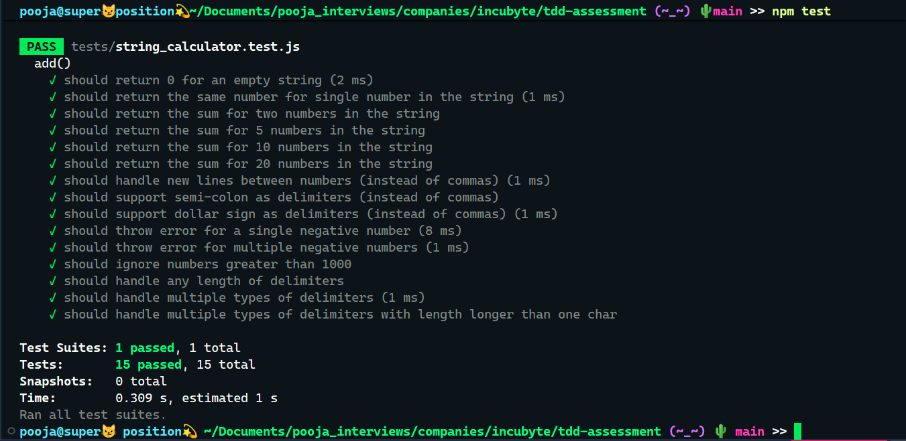

# 🧮 String Calculator

A simple String Calculator built in **JavaScript** with **Jest** for assessment purpose only.

---

## ⚙️ Setup Instructions

### 1. Clone the repository
```bash
git clone https://github.com/Poojagajbhiye/tdd-assessment.git
cd tdd-assessment
```

### 2. Install dependencies
```bash
npm install
```

### 3. Run the tests
```bash
npm test
```

## ✅ Test Results
You should see all tests passing as below.
